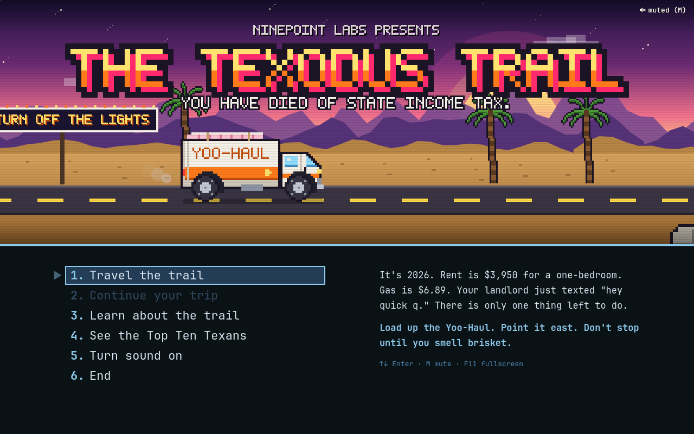
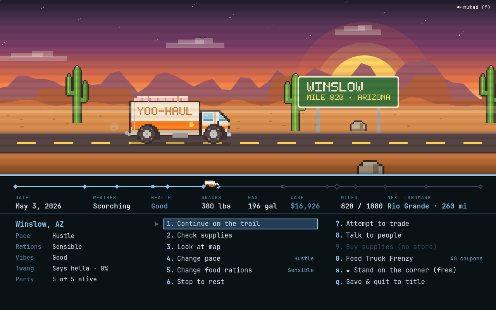
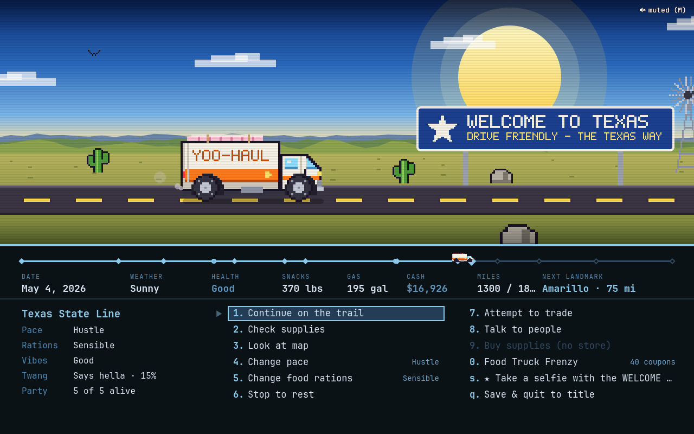
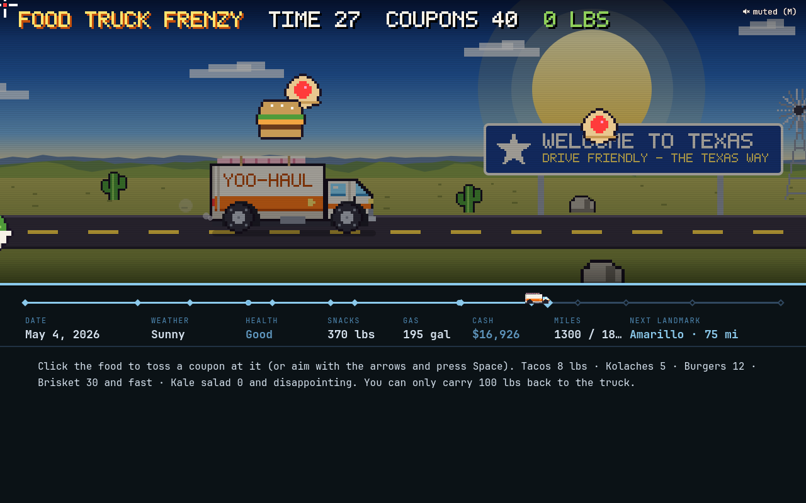
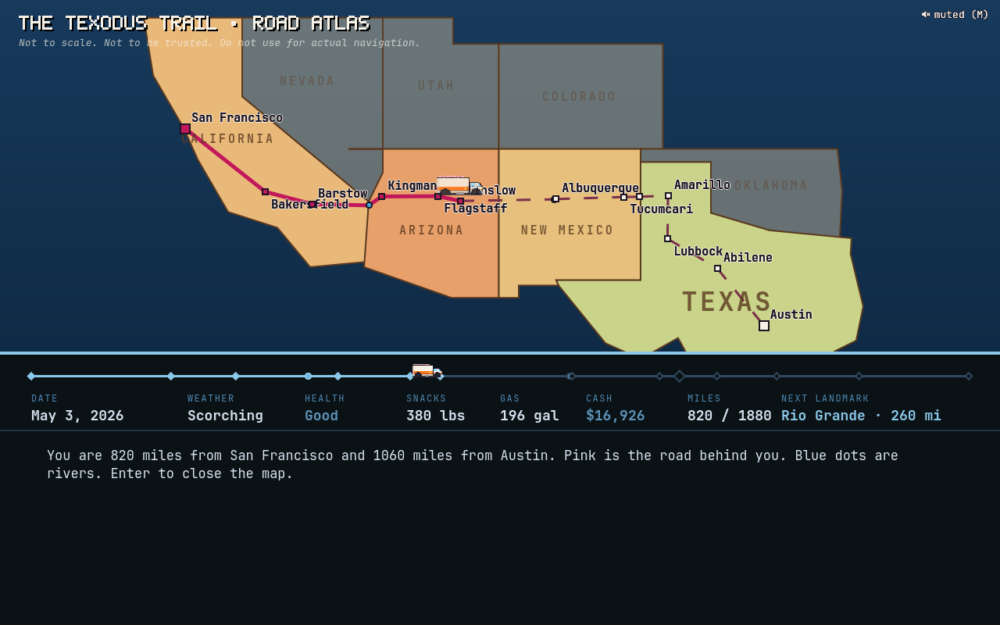

# The Texodus Trail

*You have died of state income tax.*

**[Watch the trailer and visit the website](https://ninepointlabs.github.io/texodus-trail/)**

It's 2026. Rent in San Francisco is $3,950 for a one-bedroom, gas is $6.89 a
gallon, and your landlord just texted "hey quick q." There's only one thing
left to do: load up a Yoo-Haul, strap the mattress to the roof, and point it
at Austin.

**The Texodus Trail** is the classic *Oregon Trail* reimagined for the great
California-to-Texas migration, built as a native Omarchy app. 1,880 miles of
I-40, two river crossings, one 72 oz steak, and a Buc-ee's the size of a
regional airport. Your party will get dysentery. It's tradition.

<p align="center">
  
</p>

## What's in it

- **The whole Oregon Trail loop.** Pick an occupation, name your party,
  choose a month, shop, then drive, size up the situation, rest, trade, talk
  to people, ford rivers, and bury your friends. Classic numbered menus, a
  status line, and a Top Ten.
- **Four occupations.** Laid-off FAANG Engineer (steady cash, fixes the
  alternator "as a hotfix"), Lifestyle Influencer (every disaster is
  content, ×2 points), Crypto Bro (net worth moves 10% a day, WAGMI) and
  Hollywood Screenwriter (broke, brave, ×3 points). Hard mode is the one with
  the dentist detective pilot.
- **Fifteen landmarks along the real route.** San Francisco, Bakersfield,
  Barstow (last In-N-Out!), the Colorado River at Needles, Kingman, Flagstaff,
  standin' on a corner in Winslow, the Rio Grande, Albuquerque, Tucumcari
  Tonite, the Texas state line, Amarillo, Lubbock, Abilene and Austin.
- **Gas gets cheaper every state.** California charges $6.89 and extra for
  the vibes; Texas is practically free. Plan accordingly.
- **Thirty-odd things that happen on the road.** The Franchise Tax Board
  wants to know where you think you're going. A tumbleweed the size of a
  Prius. A haboob. An abandoned Peloton still running a class. Close
  encounters near Roswell. ERCOT. A church potluck. "Bless your heart."
- **Food Truck Frenzy.** The hunting minigame, for people who have only ever
  hunted parking spots. Toss coupons at flying tacos, kolaches and brisket.
  Avoid the kale salad. You can only carry 100 lbs back to the truck, because
  it's full of air fryers.
- **Twang and Vibes.** Learn to say "y'all" (it's one syllable), buy a hat,
  conquer the steak, and watch your Twang climb. It's worth points.
- **Graves that stay.** When someone dies you write their epitaph, and every
  future trip passes their tombstone at that mile marker. *Here lies Kale.
  Should have bought Bitcoin in 2011.*
- **It looks the part.** A side-scrolling pixel-art diorama with three layers
  of parallax mountains, a synthwave sun, billboards with marquee bulbs,
  weather (smoke, dust storms, snow, hail, heat shimmer), and a sky that turns
  from California sunset to big Texas blue as you go.
- **It sounds the part.** An original chiptune theme, a boom-chick travel
  loop and sixteen sound effects, all generated from scratch by a tiny synth
  in `tools/make-sounds.py`.

<p align="center">
  
  
</p>
<p align="center">
  
  
</p>

## Native to Omarchy

- **Wears your theme.** Every menu, highlight and status line uses the current
  Omarchy theme, read live from `~/.local/state/omarchy/current/theme`, so
  `omarchy theme set` restyles the game while you play. The scenery keeps its
  own sunset, because some things are sacred.
- **Runs on Quickshell,** the same engine as the Omarchy shell. No Electron,
  no browser, no Python, and on Omarchy nothing extra to install.
- **Plays nice with Hyprland.** It opens as a centered, floating 16:10 window
  sized to your monitor, and launching it again just focuses the one that's
  already open. F11 goes fullscreen.
- **Saves after every move** to `~/.local/state/texodus-trail/save.json`.
  Close it mid-river, reboot, come back next week: your party will still be
  standing on the bank.

## Requirements

On Omarchy: nothing. Everything it needs ships with Omarchy.

Anywhere else, you need a Wayland desktop and:

| | Arch | Fedora | Debian / Ubuntu | Nix |
|---|---|---|---|---|
| [Quickshell](https://quickshell.org) (required) | `quickshell` | `quickshell` from the `errornointernet/quickshell` COPR | build from source | `quickshell` |
| Qt 6 multimedia (for sound) | `qt6-multimedia` | `qt6-qtmultimedia` | `qml6-module-qtmultimedia` | `qt6.qtmultimedia` |
| `jq` (for the launcher) | `jq` | `jq` | `jq` | `jq` |

`install.sh` checks these and tells you the package name for your distro.
Without Qt multimedia the game runs silent; without `jq` it runs in a plain
window.

How it behaves away from Omarchy:

- **Hyprland 0.56 or newer** gets the full treatment: a floating, centered,
  fully opaque window, and relaunching focuses the one that's open. Older
  Hyprland versions and other compositors (Sway, niri, GNOME, KDE) run the
  game in an ordinary window.
- **No Omarchy theme?** The menus fall back to a built-in palette. The
  scenery never used the theme anyway.
- **Tested on:** Omarchy (Arch) with Qt 6.11, Quickshell 0.3.1 and Hyprland
  0.56. Other distros should work given the packages above, but haven't been
  tried yet. If yours misbehaves, open an issue and tell me what you're on.

## Install

```bash
git clone https://github.com/ninepointlabs/texodus-trail ~/Projects/texodus-trail
cd ~/Projects/texodus-trail
./install.sh
```

Then launch **The Texodus Trail** from the app launcher (Super + Space), or
run `texodus`. The installer only writes to your home directory:

| What | Where |
|------|-------|
| The game | `~/.local/share/texodus-trail/` |
| Launcher | `~/.local/bin/texodus` |
| App entry | `~/.local/share/applications/texodus-trail.desktop` |
| Icon | `~/.local/share/icons/hicolor/256x256/apps/texodus-trail.png` |

Run `./install.sh` again after pulling to update. `texodus --tiled` skips the
floating window if you'd rather let Hyprland tile it.

Want a key for it? Add this to `~/.config/hypr/bindings.lua`:

```lua
o.bind("SUPER + SHIFT + ALT + T", "The Texodus Trail", "~/.local/bin/texodus")
```

### Remove

```bash
./install.sh --uninstall   # keeps your save and Top Ten
./install.sh --purge       # paves over the graves too
```

## Playing

| Key | Does |
|-----|------|
| `1`-`9`, `0`, letters | pick a menu item |
| `↑` `↓` `←` `→`, `Enter` | move around menus and pick |
| `Space` | stop the truck to size up the situation; dismiss messages |
| `←` `→` or `+` `-` | add or remove from your cart in a store |
| `Esc` | back out of a store, map or menu |
| `M` | mute (the game remembers) |
| `F11` | fullscreen |
| `Ctrl+Q` | quit (you're already saved) |

The mouse works everywhere too. In the Food Truck Frenzy, click the food, or
aim with the arrows and press Space.

A few tips from Kyle at Costco:

- About 150 gallons of gas, 300 lbs of snacks, a few bottles of sunscreen
  and a couple of spare tires gets most people there. Buy less gas in
  California; it gets cheaper every state.
- Grindset pace gets you there fast and gets people killed. Rest when folks
  get sick.
- The toll bridge is boring. Boring is good. Fording a 6 ft river in a
  26-foot rental truck is how legends (and tombstones) are made.
- April is the sweet spot. August is a dare.

## Development

```
app/            the game: shell.qml (window), App.qml (screens), Scene.qml
                (the road), Game.js (the engine), Sprites.js, sounds/
bin/texodus     launcher
tools/          sprite, sound and icon generators; headless screenshot rig
test/           engine fuzzer and end-to-end UI test
```

Run it straight from the checkout with `quickshell -p app` (it hot-reloads as
you edit).

- `node test/play.js 3000` plays three thousand random trips against the
  engine and checks every invariant after every action.
- `test/ui.sh` runs the real UI headlessly with `qmltestrunner`, pressing
  actual keys from the title screen to the Top Ten.
- `tools/snap.sh <dir> wait:2000 shot:title.png ...` takes screenshots
  without a compositor (that's how the ones above were made).
- `python3 tools/sprites.py` redraws `app/Sprites.js` from the drawing code;
  `python3 tools/make-sounds.py` regenerates every sound; `tools/make-icon.py`
  the icon (needs Pillow).
- While the game is running, `tools/drive.sh state` (or `key space`,
  `travel 3`, ...) pokes it over Quickshell IPC.

## Fine print

A loving parody. Yoo-Haul isn't a real company, Kyle isn't a real Kyle, and
no Californians or Texans were harmed in the making of this game. Everybody
in it is just trying to find somewhere to live where the tacos are good and
the rent is fine. Be excellent to each other.

Inspired by *The Oregon Trail* (MECC, 1971/1985), which ruined a generation's
relationship with rivers.

MIT licensed. See [LICENSE](LICENSE).
